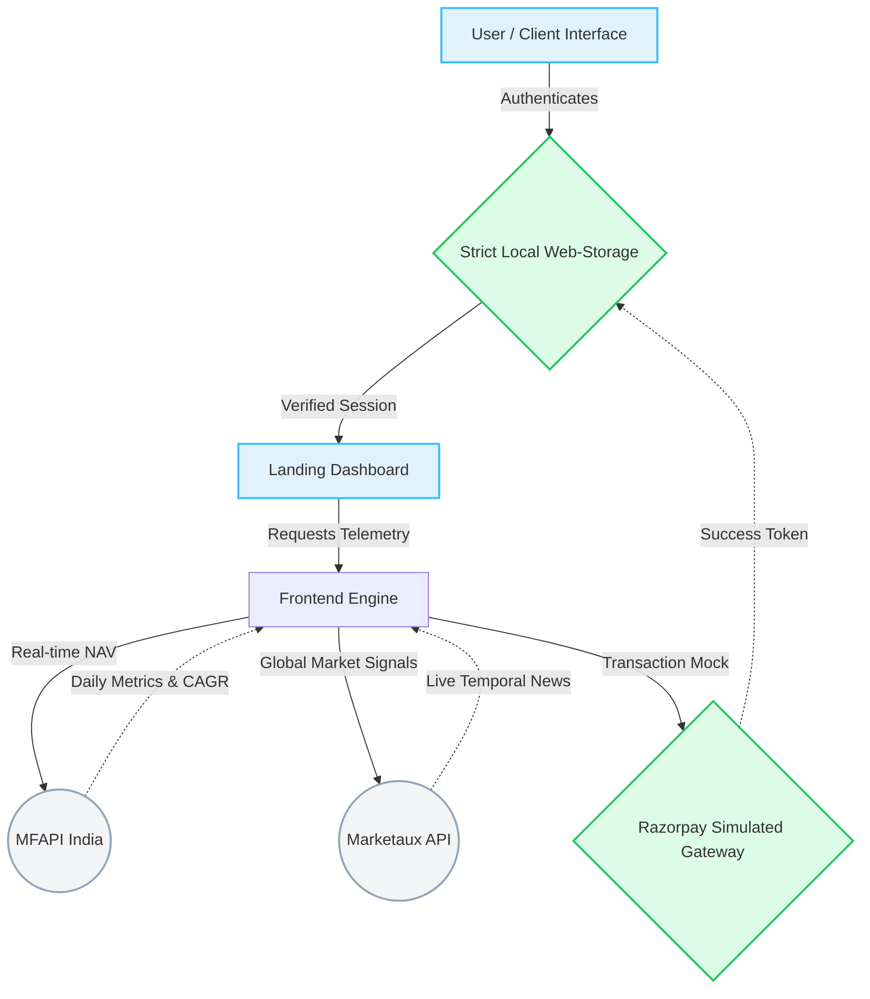

<div align="center">
  
  <h1 align="center">Ramaniya</h1>
  <p align="center">
    <strong>Intelligent Mutual Fund & Market Telemetry Platform</strong>
  </p>

  <p align="center">
    <a href="#features"></a>
    <a href="#features"></a>
    <a href="#features"></a>
  </p>
</div>

---

Ramaniya is a premium, modern, and highly modular Financial Technology (Fintech) web application designed to help users intelligently invest in Mutual Funds. Drawing profound inspiration from top-tier platforms like Groww and Zerodha Coin, Ramaniya features an extremely dense, data-rich user interface wrapped in a beautiful, minimalist aesthetic.

---

## 📊 Core Architecture & Data Flow



---

## 🌟 Feature Matrix

| Functional Area | Key Capabilities | Technology / Implementation |
| :--- | :--- | :--- |
| **🛡️ Financial Security Workflow** | Mandatory sequential pipelines preventing bypass. | Simulated PAN Verification, Video KYC |
| **📈 Dynamic Dashboards** | Calculates weighted allocations, percentages, and absolute P&L. | Recharts `LineChart`, Asset Progress Bars |
| **📡 Live API Telemetry** | Queries direct raw datasets instead of utilizing mocks. | Integrated `api.mfapi.in` Native Fetching |
| **💳 Seamless Checkout Overlays** | Handles multiple transaction architectures (UPI, Card, Netbanking). | React Modal Portals |
| **🗞️ Market Signals Center** | Displays Temporal Market News (24H, 7D, 1M). | Target: `api.marketaux.com` with Failover |

---

## 💎 In-Depth Highlights

### 1. Robust Live API Integrations
This application operates on top of real-world datasets rather than purely static mocks:
- **MFAPI Engine:** Directly queries real-time Net Asset Value (NAV) metrics, historical trajectories, and dynamic 3-Year CAGRs securely pulling records from SEBI-registered Mutual Funds in India.
- **Marketaux News Feed:** Operates a real-time aggregated market signals center globally. Equipped with temporal mapping to the Indian Securities Market. *(Includes mathematically accurate mocked fallbacks ensuring zero UI breakage).*

### 2. Client-Side Database Layer
Relies comprehensively on highly optimized Browser `LocalStorage` to seamlessly memorize session tokens, structured transaction hierarchies, strict KYC state machines, and massive API caches—delivering blazing fast rendering without requiring backend delays for this demo.

---

## 🚀 Getting Started

Follow these explicit steps to run the massive environment locally.

### 📌 Prerequisites
Make sure you have [Node.js](https://nodejs.org/) (v18 or higher) installed locally.

### ⚙️ Installation & Launch

**1. Clone the repository**
```bash
git clone https://github.com/RohanShrivastava08/ramaniya-mf-app.git
cd ramaniya-mf-app
```

**2. Initialize the Client Workspace**
```bash
cd frontend
npm install
```

**3. Boot the Vite Orchestration Server**
```bash
npm run dev
```
> The architecture immediately boots entirely offline up to `http://localhost:5173`. Open this target in your web browser.

---

## 🔐 Optional: Activating True Live News
To activate absolute real-time global news data queries, securely drop your API token in the frontend directory:

1. Create a file named `.env` strictly inside `/frontend`.
2. Insert your Marketaux Access Token:
```env
VITE_MARKETAUX_API_TOKEN=your_token_here_123abc
```
*(If you bypass this protocol, Ramaniya securely utilizes an intelligent fallback wrapper presenting 100% realistic dummy economic data so the UI remains pristine).*

---
<div align="center">
  <p>Engineered with meticulous focus on advanced UI/UX mathematics to build an unmatched modern Fintech experience.</p>
</div>
